# Reporte Series de Tiempo

## Integrantes

- Flavio Galán - 22386
- Josué Say - 22801

## Repositorio

- [Enlace a GitHub](https://github.com/JosueSay/labs-ds)
- No se trabajó google docs sino md en el repositorio en la carpeta [docs/reporte](https://github.com/JosueSay/labs-ds/blob/main/docs/reporte.md)

## 1. Introducción

El objetivo de este análisis es modelar y predecir el comportamiento de tres series relacionadas con el mercado de combustibles en Guatemala: consumo mensual de diésel, importaciones de gas licuado de petróleo (GLP) y precios de gasolina regular. Para ello se utilizaron datos mensuales entre los años 2000 y 2025, obtenidos de fuentes nacionales y públicas.

El estudio incluye una exploración del comportamiento histórico de las variables, considerando eventos relevantes como la pandemia por COVID-19 y la guerra entre Rusia y Ucrania, que afectaron la oferta y demanda energética a nivel global. Se eligieron las series por su relevancia económica y su diversidad de comportamiento: consumo estable, importaciones volátiles y precios sensibles a factores externos. El análisis busca identificar patrones, evaluar modelos de predicción y proyectar tendencias futuras.

## 2. Descripción de los datos

Los datos utilizados provienen del portal de acceso a la información pública del Ministerio de Energía y Minas de Guatemala. Las series abarcan el periodo 2000 a 2025, con frecuencia mensual, e incluyen variables de consumo, importación y precios de cuatro tipos de combustible: diésel, gasolina regular, gasolina superior y GLP.

Las unidades están expresadas en barriles para consumo e importación y en quetzales por galón o quetzales por cilindro de 25 lb para los precios. Se estandarizaron nombres, formatos de fecha y valores numéricos para facilitar el análisis.

## 3. Preparación y limpieza de datos

Se desarrolló un proceso automatizado para unificar los archivos originales, seleccionar variables relevantes, renombrar columnas y transformar las fechas al formato datetime.

Se implementó un sistema de caché para evitar reprocesamiento innecesario y se estructuraron archivos intermedios en CSV que pueden ser reutilizados.

La limpieza incluyó control de duplicados, revisión de valores extremos y armonización de unidades. Todo el procedimiento se detalla en el notebook entregado.

## 4. Análisis exploratorio

El análisis exploratorio se enfocó en comprender la evolución y comportamiento general de las variables seleccionadas. Se presentan estadísticas descriptivas (media, mediana, máximos y mínimos) por combustible y tipo de variable (consumo, importación y precios), las cuales permiten identificar diferencias en volumen, dispersión y comportamiento.

Se incluyeron histogramas para observar la distribución de cada serie. Estos muestran que la mayoría de las variables presentan asimetría positiva y no siguen una distribución normal. Destaca el diésel como el más estable y el GLP como el más regulado (especialmente en precios).

Además, se graficaron las series de tiempo tanto en forma combinada como individual por combustible, lo cual evidenció tendencias crecientes, caídas durante la pandemia (2020), repuntes posteriores y posibles patrones estacionales. Las gráficas están colocadas en las secciones correspondientes del reporte.

Finalmente, se utilizaron heatmaps mensuales por año para identificar estacionalidad y comportamiento interanual. Estos muestran, por ejemplo, mayor consumo e importación en la segunda mitad del año para varios combustibles, así como picos de precios en 2022. Las visualizaciones permiten reforzar el contexto histórico de cada serie.

**Tabla 1. Estadísticas descriptivas – Consumo mensual (barriles):**

| Combustible | Promedio (barriles) | Mínimo  | Máximo    | Observaciones clave                                               |
| ----------- | ------------------- | ------- | --------- | ----------------------------------------------------------------- |
| Regular     | 405,017             | 160,742 | 942,394   | Alta dispersión. Consumo se ha más que duplicado desde el mínimo. |
| Superior    | 474,466             | 300,243 | 790,948   | Menor varianza relativa que la regular.                           |
| Diésel      | 880,198             | 507,663 | 1,474,651 | El más consumido con diferencia.                                  |
| GLP         | 322,886             | 167,818 | 600,454   | Menor consumo.                                                    |

**Tabla 2. Estadísticas descriptivas – Importaciones mensuales (barriles):**

| Combustible | Promedio (barriles) | Mínimo  | Máximo    | Observaciones clave                           |
| ----------- | ------------------- | ------- | --------- | --------------------------------------------- |
| Regular     | 419,996             | 81,015  | 1,141,366 | Alta variabilidad.                            |
| Superior    | 494,588             | 170,293 | 1,227,174 | Similar a la regular, pero con mayor volumen. |
| Diésel      | 899,561             | 229,765 | 1,617,427 | Confirma alta dependencia.                    |
| GLP         | 422,204             | 100,562 | 1,077,123 | Muy variable, picos fuertes.                  |

**Tabla 3. Estadísticas descriptivas – Precios mensuales (Q/galón):**

| Combustible | Mediana (Q/galón) | Rango Intercuartílico | Máximo | Observaciones clave                                |
| ----------- | ----------------- | --------------------- | ------ | -------------------------------------------------- |
| Regular     | Q30.78            | Q28.28 – Q33.28       | Q40.50 | Aumentos significativos post-2022.                 |
| Superior    | Q32.19            | Q29.51 – Q34.52       | Q43.24 | Precio más alto, pero sigue patrón de la regular.  |
| Diésel      | Q27.73            | Q25.44 – Q31.30       | Q41.27 | Más volátil. Alta subida en eventos críticos.      |
| GLP (25 lb) | Q20.35            | Q19.50 – Q20.69       | Q24.93 | Más estable, pero con picos.                       |

### Histogramas

El análisis de los histogramas revela que ninguna de las variables (consumo, importación o precios) sigue una distribución normal. En el caso del consumo e importación, se observa una fuerte asimetría positiva, especialmente en gasolina regular y GLP, con presencia de valores extremos que reflejan eventos puntuales de alta demanda. El diésel destaca por ser el más estable y con mayor volumen en ambas dimensiones, lo que lo convierte en un buen candidato para modelado directo. En cuanto a los precios, las gasolinas regular y superior presentan distribuciones más simétricas, mientras que el diésel muestra alta variabilidad, probablemente influenciada por factores externos. El GLP, por su parte, presenta una distribución escalonada, indicando posible regulación o control estatal.

  

  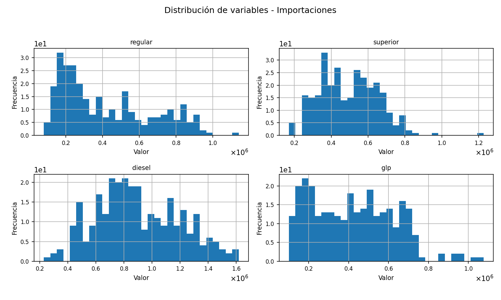

  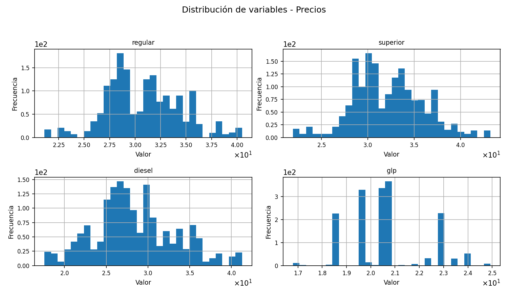

### Series de tiempo

Las series de tiempo de consumo, importaciones y precios reflejan tendencias crecientes sostenidas, interrumpidas por eventos externos como la pandemia en 2020 y choques de precios en 2022. El diésel domina en volumen, mientras que el GLP muestra un crecimiento reciente. Los precios son más volátiles y responden a factores internacionales. Hay indicios de estacionalidad y comportamientos estructurales distintos por tipo de combustible.

**Consumos:**

  

<table style="margin: auto; text-align: center; border-collapse: collapse; border: none;">
  <tr>
    <td style="border: none;">
      
    </td>
    <td style="border: none;">
      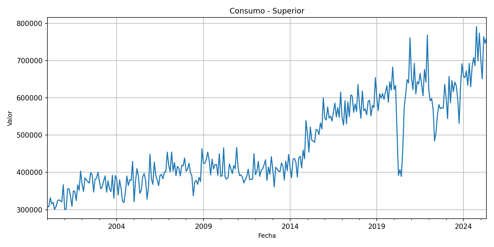
    </td>
  </tr>
  <tr>
    <td style="border: none;">
      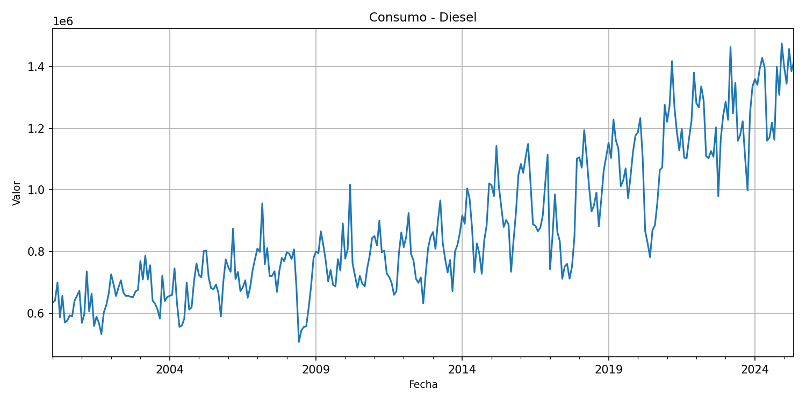
    </td>
    <td style="border: none;">
      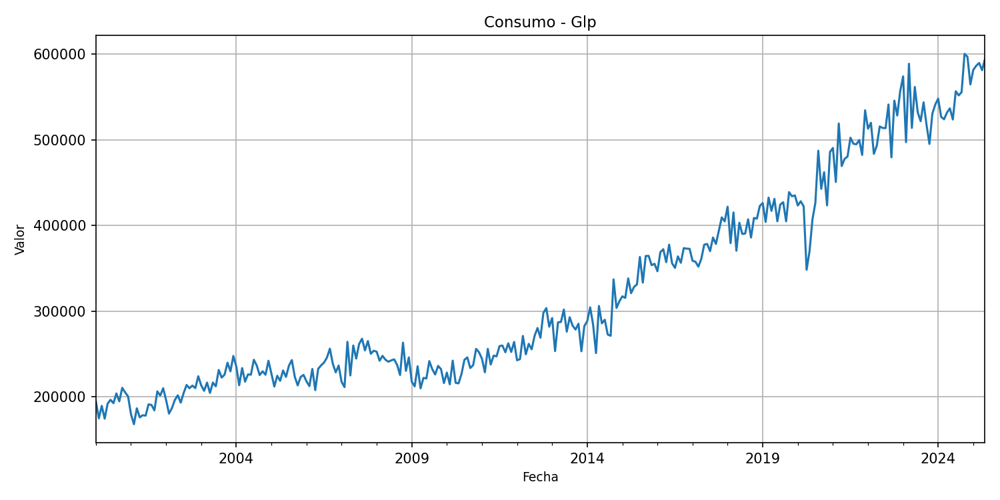
    </td>
  </tr>
</table>

**Importaciones:**

  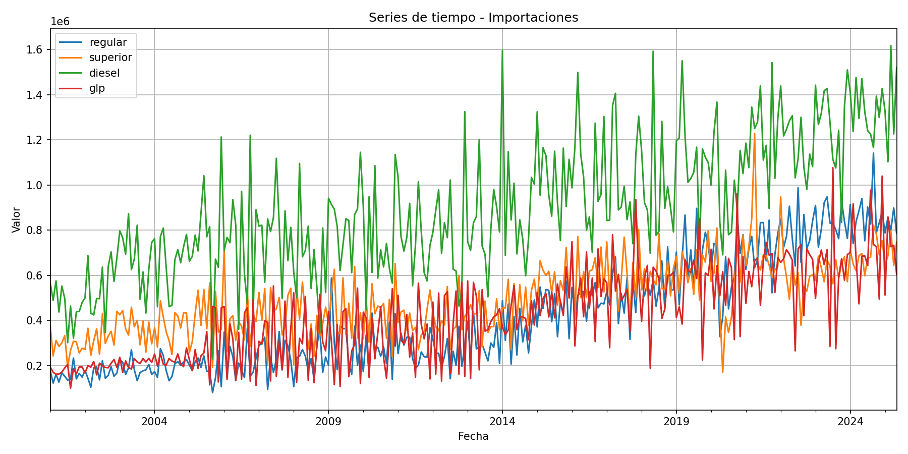

<table style="margin: auto; text-align: center; border-collapse: collapse; border: none;">
  <tr>
    <td style="border: none;">
      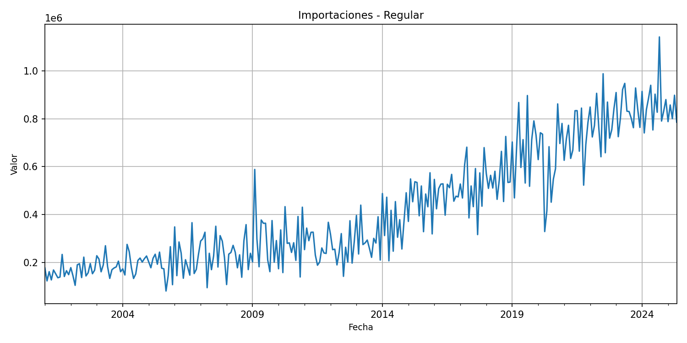
    </td>
    <td style="border: none;">
      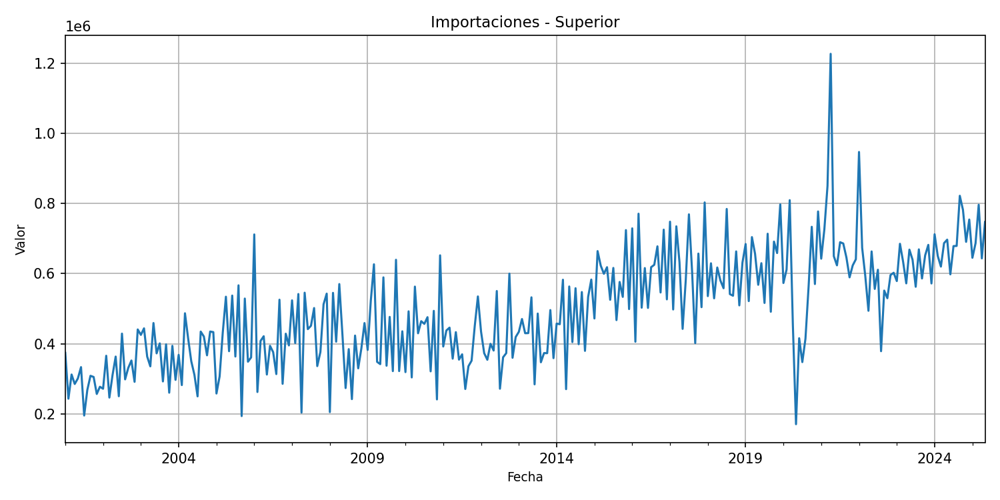
    </td>
  </tr>
  <tr>
    <td style="border: none;">
      
    </td>
    <td style="border: none;">
      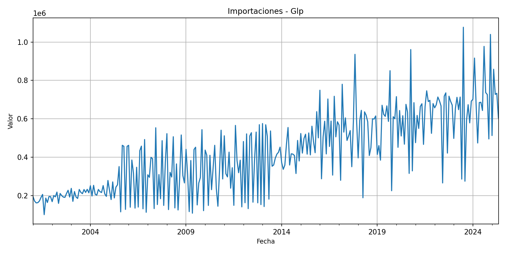
    </td>
  </tr>
</table>

**Precios:**

  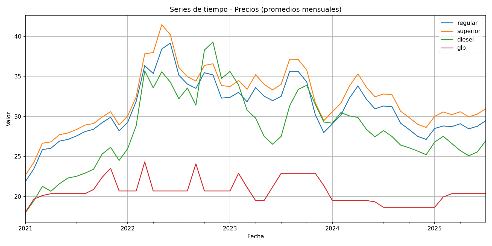

<table style="margin: auto; text-align: center; border-collapse: collapse; border: none;">
  <tr>
    <td style="border: none;">
      
    </td>
    <td style="border: none;">
      
    </td>
  </tr>
  <tr>
    <td style="border: none;">
      
    </td>
    <td style="border: none;">
      
    </td>
  </tr>
</table>

### HeatMap mensual por año

El consumo muestra una tendencia creciente sostenida desde 2015, con caídas en 2020 y picos frecuentes en la segunda mitad del año, especialmente en diésel y gasolina regular. Las importaciones siguen un patrón similar, reforzando la relación entre demanda interna y abastecimiento externo, aunque con mayor variabilidad mensual. En cuanto a precios, se observa un fuerte incremento en 2022 (especialmente en diésel y gasolina) seguido de una estabilización gradual. GLP destaca por su estabilidad tanto en consumo como en precios.

**Consumos:**

<table style="margin: auto; text-align: center; border-collapse: collapse; border: none;">
  <tr>
    <td style="border: none;">
      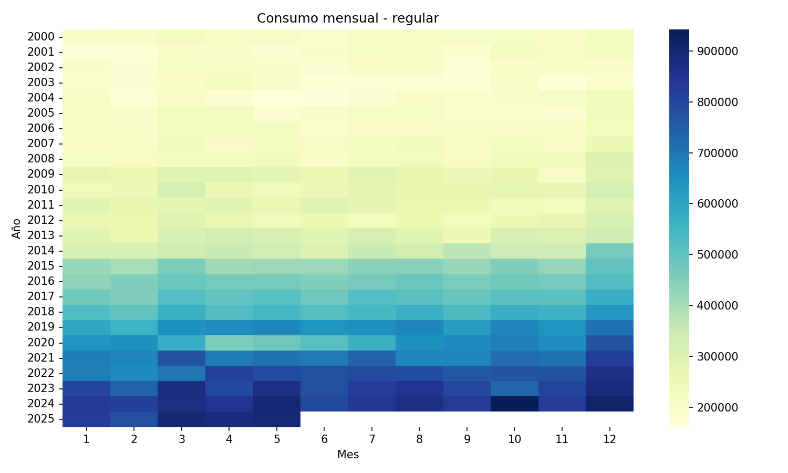
    </td>
    <td style="border: none;">
      
    </td>
  </tr>
  <tr>
    <td style="border: none;">
      
    </td>
    <td style="border: none;">
      
    </td>
  </tr>
</table>

**Importaciones:**

<table style="margin: auto; text-align: center; border-collapse: collapse; border: none;">
  <tr>
    <td style="border: none;">
      
    </td>
    <td style="border: none;">
      
    </td>
  </tr>
  <tr>
    <td style="border: none;">
      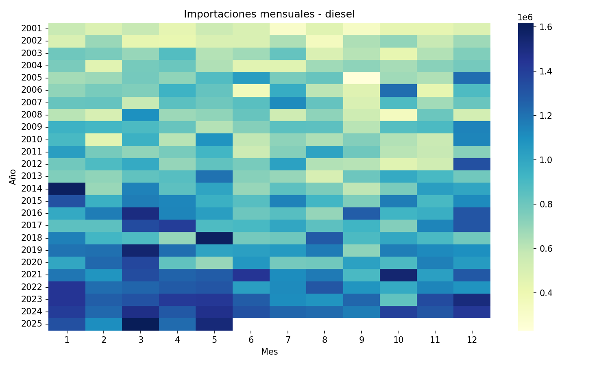
    </td>
    <td style="border: none;">
      
    </td>
  </tr>
</table>

**Precios:**

<table style="margin: auto; text-align: center; border-collapse: collapse; border: none;">
  <tr>
    <td style="border: none;">
      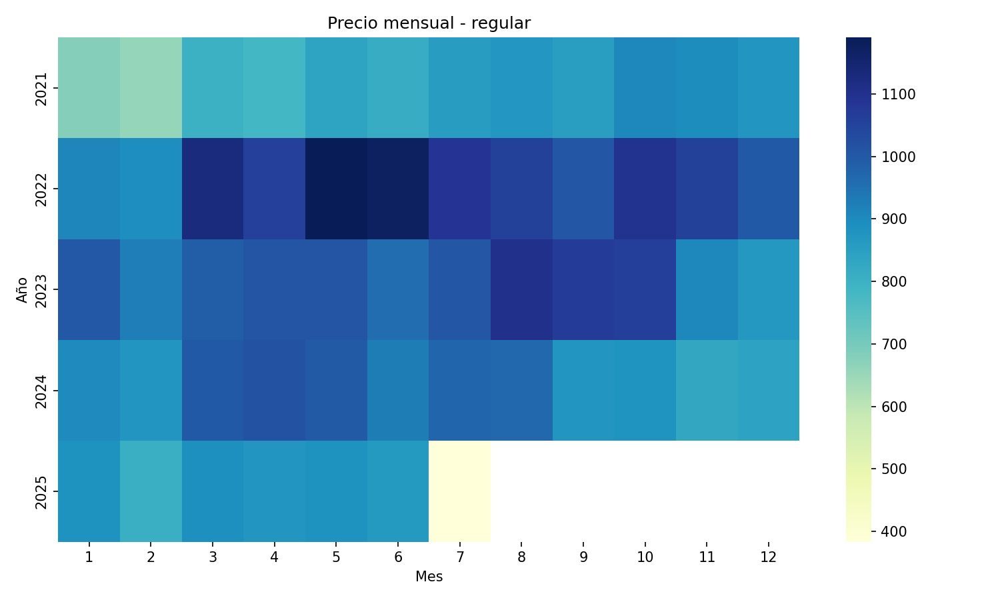
    </td>
    <td style="border: none;">
      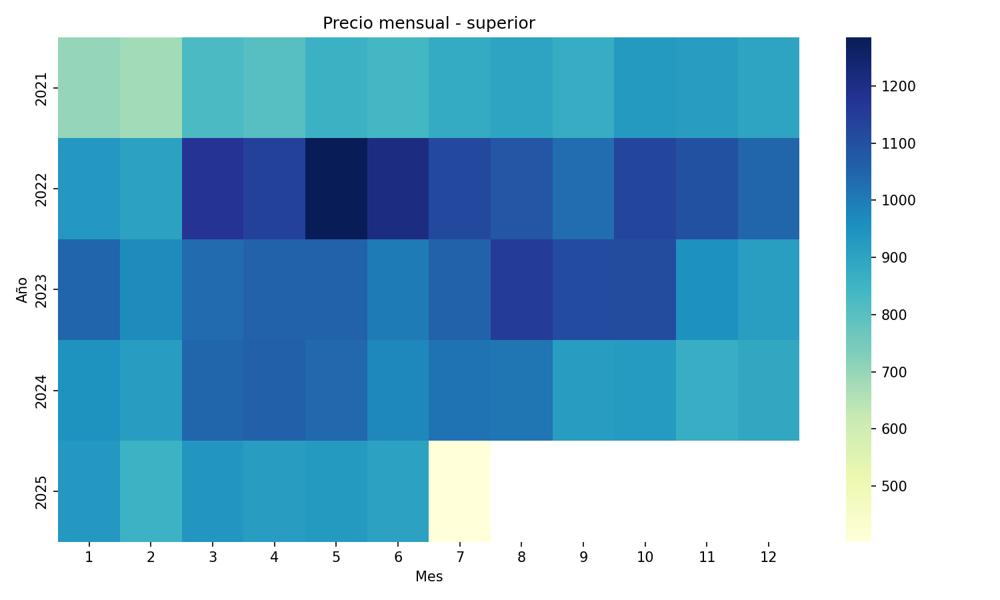
    </td>
  </tr>
  <tr>
    <td style="border: none;">
      
    </td>
    <td style="border: none;">
      
    </td>
  </tr>
</table>

## 5. Análisis de casos especiales

### Comportamiento en pandemia (2020-2021)

Las importaciones y precios de combustibles en Guatemala reflejaron los efectos inmediatos del confinamiento y la posterior reactivación económica. En importaciones, se observó una fuerte caída entre marzo y mayo de 2020, seguida de una recuperación progresiva, con repuntes más marcados en diésel y superior. El GLP mostró alta volatilidad. En precios, todos los combustibles experimentaron incrementos sostenidos durante 2021, especialmente la gasolina regular y superior, alineados con el alza global del crudo. El GLP, en cambio, mostró aumentos escalonados.En conjunto, las gráficas evidencian una respuesta inicial de choque en volúmenes importados, seguida de una normalización parcial con alzas de precios.

**Consumos:**

  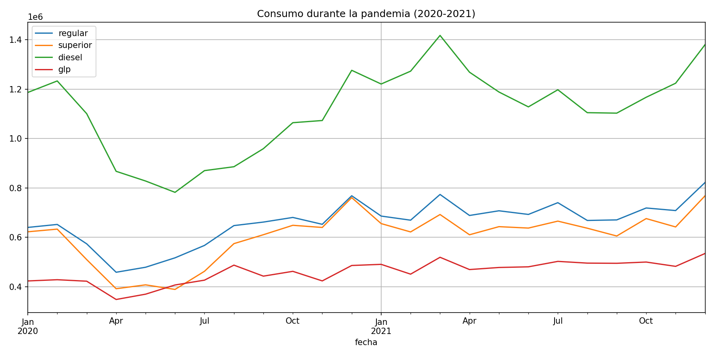

<table style="margin: auto; text-align: center; border-collapse: collapse; border: none;">
  <tr>
    <td style="border: none;">
      
    </td>
    <td style="border: none;">
      
    </td>
  </tr>
  <tr>
    <td style="border: none;">
      
    </td>
    <td style="border: none;">
      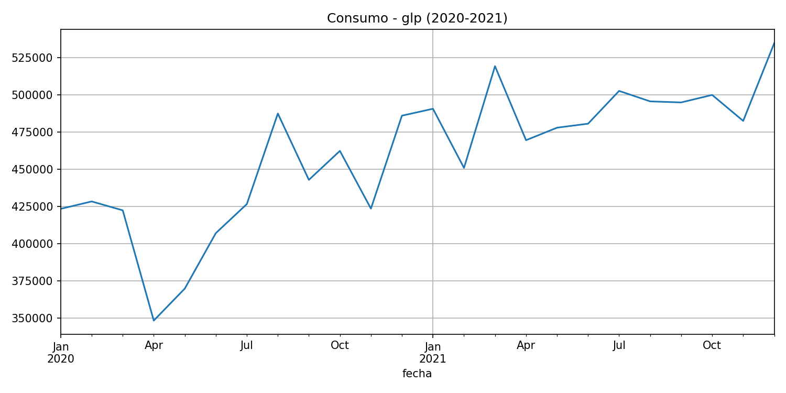
    </td>
  </tr>
</table>

**Importaciones:**

  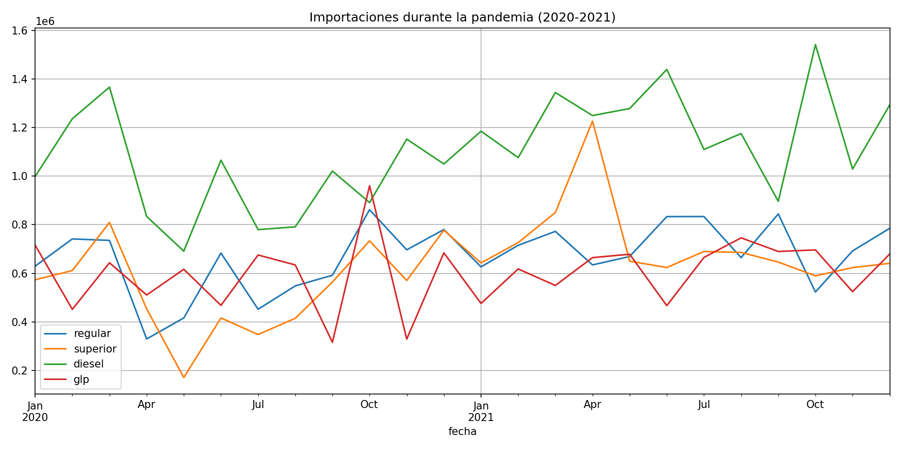

<table style="margin: auto; text-align: center; border-collapse: collapse; border: none;">
  <tr>
    <td style="border: none;">
      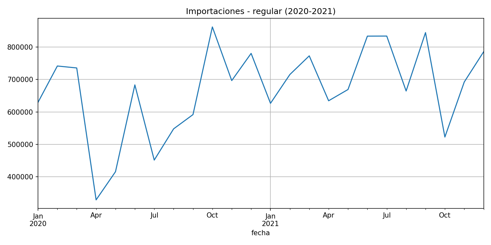
    </td>
    <td style="border: none;">
      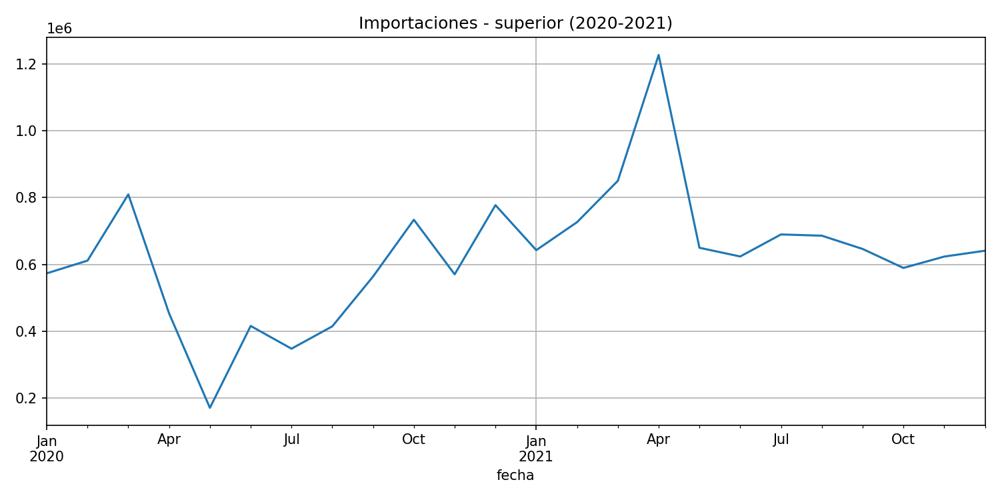
    </td>
  </tr>
  <tr>
    <td style="border: none;">
      
    </td>
    <td style="border: none;">
      
    </td>
  </tr>
</table>

**Precios:**

<table style="margin: auto; text-align: center; border-collapse: collapse; border: none;">
  <tr>
    <td style="border: none;">
      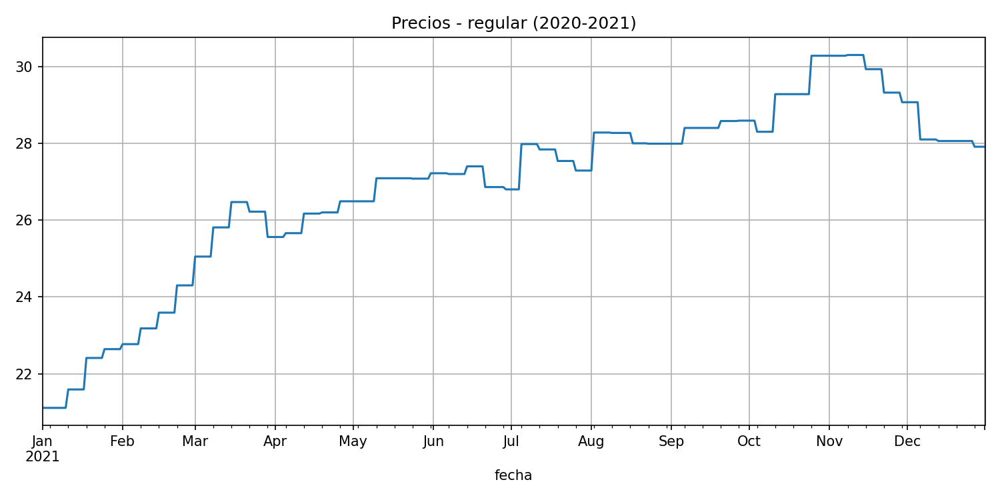
    </td>
    <td style="border: none;">
      
    </td>
  </tr>
  <tr>
    <td style="border: none;">
      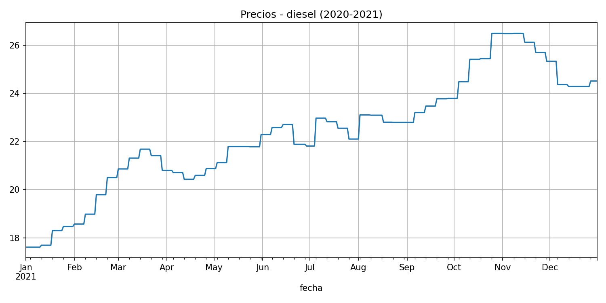
    </td>
    <td style="border: none;">
      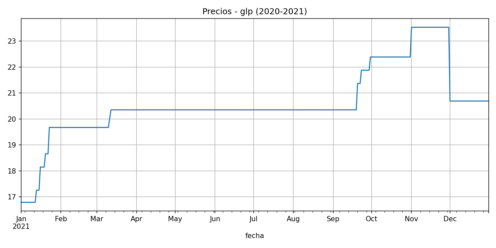
    </td>
  </tr>
</table>

### Comportamiento reciente (2022 - 2025)

Durante el período 2022–2025, Guatemala enfrentó un entorno energético marcado por la volatilidad postpandemia y los efectos indirectos de la guerra en Ucrania. Los precios de los combustibles se dispararon en 2022, alcanzando niveles récord, y aunque comenzaron a descender gradualmente desde 2023, persistieron oscilaciones que reflejan la inestabilidad global. Las importaciones de combustibles se mantuvieron activas, con el diésel liderando el volumen, pero mostrando variabilidad significativa, especialmente en GLP. El consumo interno mostró una recuperación firme luego del impacto del COVID-19, con tendencias estacionales claras y una demanda creciente en todos los productos, particularmente diésel y GLP.

**Consumos:**

  

<table style="margin: auto; text-align: center; border-collapse: collapse; border: none;">
  <tr>
    <td style="border: none;">
      
    </td>
    <td style="border: none;">
      
    </td>
  </tr>
  <tr>
    <td style="border: none;">
      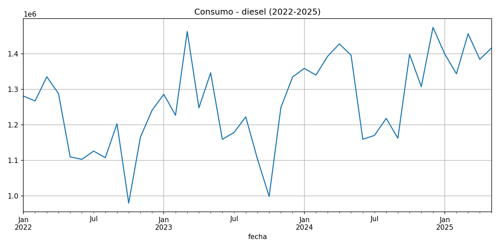
    </td>
    <td style="border: none;">
      
    </td>
  </tr>
</table>

**Importaciones:**

  

<table style="margin: auto; text-align: center; border-collapse: collapse; border: none;">
  <tr>
    <td style="border: none;">
      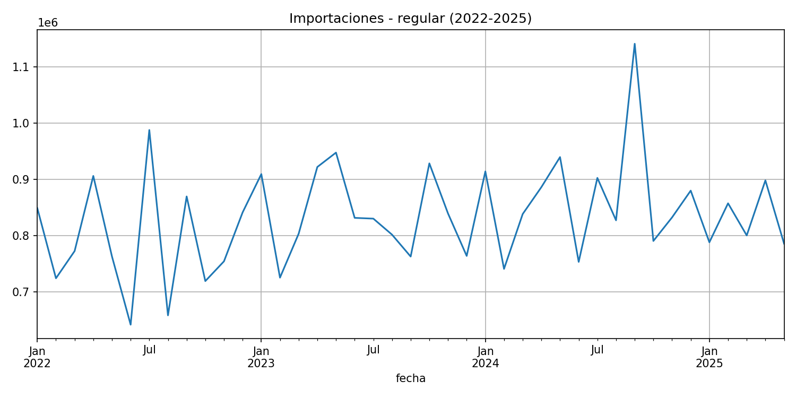
    </td>
    <td style="border: none;">
      
    </td>
  </tr>
  <tr>
    <td style="border: none;">
      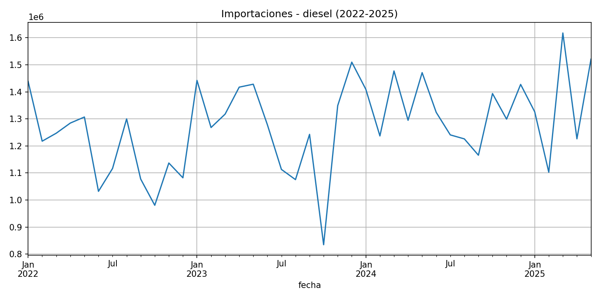
    </td>
    <td style="border: none;">
      
    </td>
  </tr>
</table>

**Precios:**

  

<table style="margin: auto; text-align: center; border-collapse: collapse; border: none;">
  <tr>
    <td style="border: none;">
      
    </td>
    <td style="border: none;">
      
    </td>
  </tr>
  <tr>
    <td style="border: none;">
      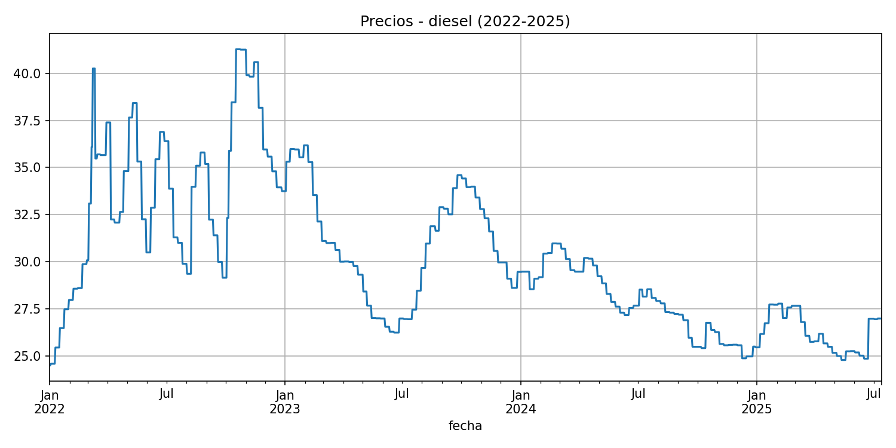
    </td>
    <td style="border: none;">
      
    </td>
  </tr>
</table>

## 6. Selección de series para modelado

Se eligieron tres series para el modelado: **precio de gasolina regular**, **consumo de diésel** e **importación de GLP**.

- **Gasolina regular (precio):** es una de las más utilizadas por el parque vehicular liviano y tiene alta sensibilidad social. Fue seleccionada para modelar precios por su relevancia económica y comportamiento volátil en los últimos años, especialmente durante eventos como la pandemia y la guerra en Ucrania.

- **Diésel (consumo):** es el combustible más consumido históricamente en el país, clave para el transporte pesado, comercio y logística. Su análisis permite entender la dinámica productiva y movilidad nacional.

- **GLP (importación):** aunque menos consumido, el GLP es esencial para el uso doméstico. Se eligió esta serie por su crecimiento reciente, alta variabilidad y la posible influencia de subsidios o regulaciones.

## 7. Modelado (por cada serie)

Para cada una de las 3 series, repite este bloque:

- Inicio, fin y frecuencia.
- Gráfico de la serie y observaciones iniciales.
- Descomposición (tendencia, estacionalidad, residuos).
- Estudio de estacionariedad: gráfica, ADF test.
- Transformaciones necesarias (log, diferencia, etc.).
- Estimación de modelos ARIMA (manual o auto\_arima).
- Comparación entre modelos (AIC, BIC, residuos).
- Modelos alternativos: Prophet, Holt-Winters, redes neuronales.

## 8. Predicción

- Inciso 4: Predicción para últimos 3 años (evaluación contra datos reales).
- Inciso 5: Predicción de 2025 completo (hasta el mes actual), comparación con realidad.

## 9. Discusión final

- Comportamiento global de las series.
- Impacto de eventos externos.
- Retos del modelado.
- Limitaciones del análisis.

## 10. Conclusiones y recomendaciones

- Hallazgos principales.
- Qué combustible tiene mejor comportamiento o más estable.
- Qué variables son más predecibles.
- Sugerencias para autoridades o usuarios.
