# Laboratorio 2 – Comparación de Modelos de Predicción

## Integrantes

- Flavio Galán - 22386
- Josué Say - 22801

## Repositorio

- [Enlace a GitHub](https://github.com/JosueSay/labs-ds/tree/main/lab2)
- No se trabajó google docs sino md en el repositorio en la carpeta [docs/reporte](https://github.com/JosueSay/labs-ds/tree/main/lab2/docs/reporte.md)

## Serie "Precios de Gasolina Regular"

### Tabla de métricas de evaluación

| Modelo                                                                                  | RMSE     | MAE       |
| --------------------------------------------------------------------------------------- | -------- | --------- |
| ARIMA(1,1,1)                                                                            | 0.185583 | 0.0637273 |
| ARIMA(0,1,1)                                                                            | 0.185578 | 0.0636919 |
| ARIMA(1,1,0)                                                                            | 0.184396 | 0.0523711 |
| ARIMA Auto                                                                              | 0.186436 | 0.0643341 |
| Prophet                                                                                 | 0.213200 | 0.131596  |
| Holt-Winters                                                                            | 0.199446 | 0.115416  |
| MLP                                                                                     | 0.190048 | 0.0755966 |
| LSTM Modelo 1 - 1 - Units: 32, Batch: 16, Epochs: 30, Optimizer: adam                   | 0.197128 | 0.113308  |
| LSTM Modelo 1 - 2 - Units: 64, Batch: 32, Epochs: 50, Optimizer: adam                   | 0.204764 | 0.133732  |
| LSTM Modelo 1 - 3 - Units: 64, Batch: 16, Epochs: 40, Optimizer: rmsprop                | 0.462503 | 0.443123  |
| LSTM Modelo 1 - 4 - Units: 128, Batch: 32, Epochs: 60, Optimizer: adam                  | 0.189733 | 0.0734671 |
| LSTM Modelo 2 - 1 - Units: 32, Batch: 16, Epochs: 30, Optimizer: adam, Dropout: 0.2     | 0.223941 | 0.153232  |
| LSTM Modelo 2 - 2 - Units: 64, Batch: 32, Epochs: 50, Optimizer: adam, Dropout: 0.3     | 0.188647 | 0.0679398 |
| LSTM Modelo 2 - 3 - Units: 64, Batch: 16, Epochs: 40, Optimizer: rmsprop, Dropout: 0.25 | 0.197485 | 0.101310  |
| LSTM Modelo 2 - 4 - Units: 128, Batch: 32, Epochs: 60, Optimizer: adam, Dropout: 0.2    | 0.241229 | 0.179526  |

### Discusión de resultados

#### ¿Cuál modelo predijo mejor?

- Según RMSE y MAE, el modelo con mejor desempeño fue ARIMA(1,1,0).
- No obstante, varios modelos LSTM, en especial el LSTM Modelo 2 – 2, alcanzaron métricas muy cercanas, superando incluso a Prophet, Holt-Winters y MLP.

#### ¿Son mejores los modelos LSTM que los del laboratorio anterior?

- Si se evalúan métricas cuantitativas (error) el modelo ARIMA(1,1,0) fue ligeramente mejor.
- Por comportamiento visual y ajuste real los modelos LSTM captaron mucho mejor las subidas, bajadas y saltos abruptos de la serie, algo que los modelos clásicos suavizaron excesivamente.

#### ¿Cómo se determinó?

- Las métricas (RMSE y MAE) se usaron como base numérica de comparación.
- Las gráficas mostraron que los LSTM siguieron con mayor fidelidad la estructura real de los precios diarios.

### Evaluación visual

Tras revisar las gráficas de predicción de todos los modelos LSTM, se identificó que el modelo que mejor se adaptó visualmente a los datos reales fue:

**LSTM Modelo 2 – 2**
(Units: 64, Batch: 32, Epochs: 50, Optimizer: adam, Dropout: 0.3)

Este modelo:

- Reprodujo con notable precisión la predicción, sin embargo, en los picos y caidas abruptas aun no se adapta completamente debido a los comportamientox externos no explicados por el modelo (algo que paso con los modelos del lab1).
- Logró mantener un alineamiento correcto en tiempo y forma con los valores reales, sin generar desplazamientos.
- Fue superior visualmente a modelos clásicos, que tienden a generar curvas.

### Gráficas

#### Laboratorio 1

<table style="margin: auto; text-align: center; border-collapse: collapse; border: none;">
  <tr>
    <td style="border: none;">
      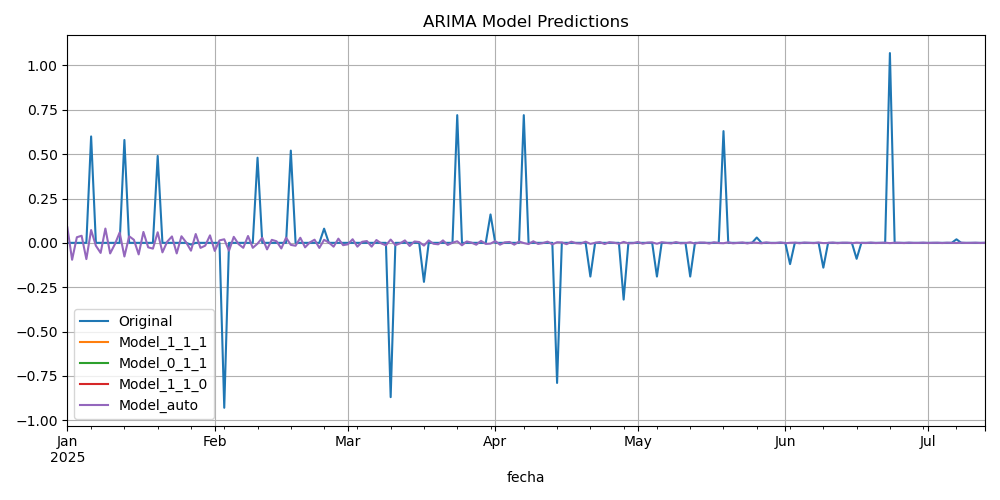
    </td>
    <td style="border: none;">
      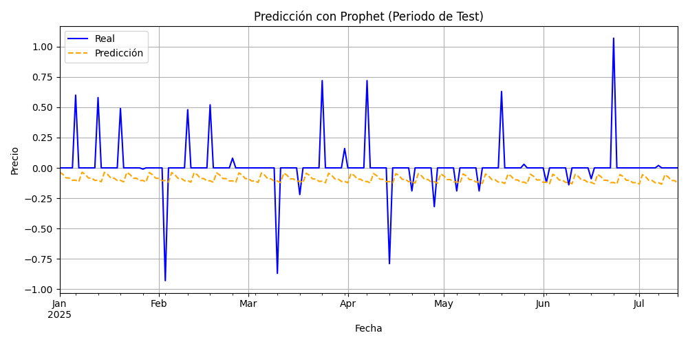
    </td>
  </tr>
  <tr>
    <td style="border: none;">
      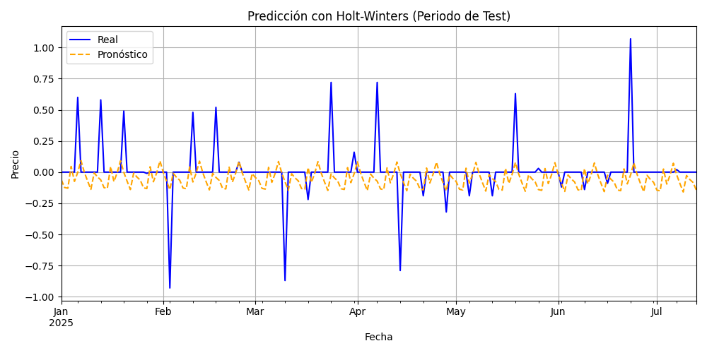
    </td>
    <td style="border: none;">
      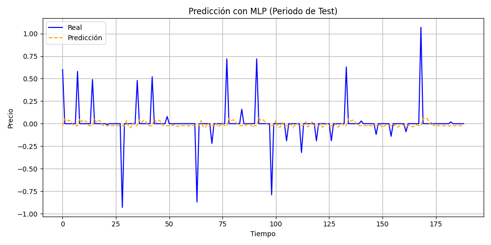
    </td>
  </tr>
</table>

#### Modelos DL - Primer modelo

<table style="margin: auto; text-align: center; border-collapse: collapse; border: none;">
  <tr>
    <td style="border: none;">
      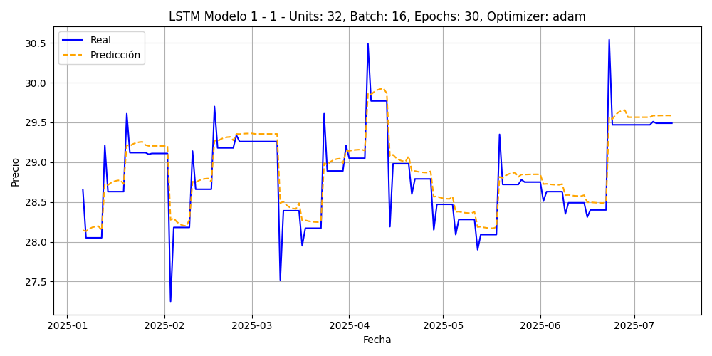
    </td>
    <td style="border: none;">
      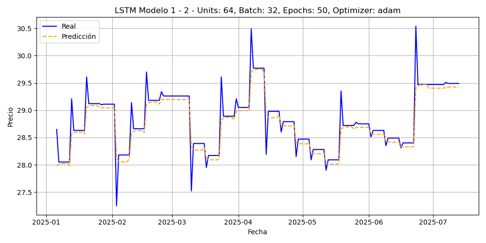
    </td>
  </tr>
  <tr>
    <td style="border: none;">
      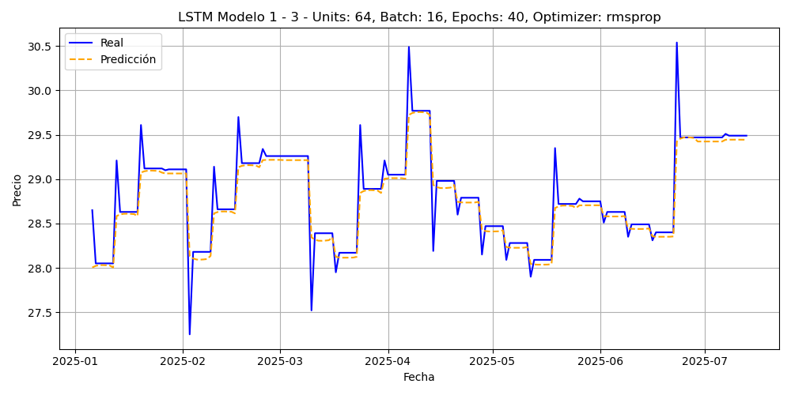
    </td>
    <td style="border: none;">
      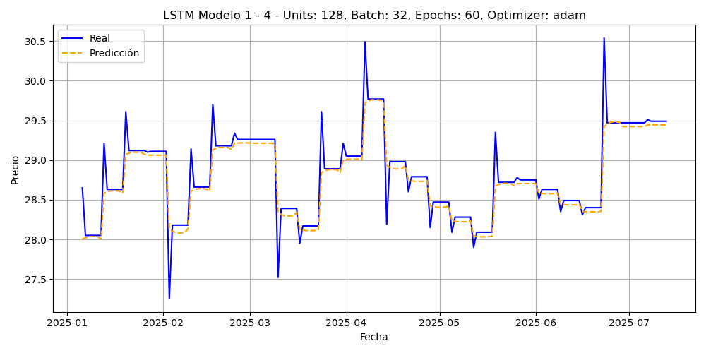
    </td>
  </tr>
</table>

#### Modelos DL - Segundo modelo

<table style="margin: auto; text-align: center; border-collapse: collapse; border: none;">
  <tr>
    <td style="border: none;">
      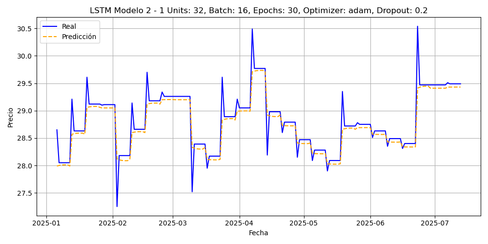
    </td>
    <td style="border: none;">
      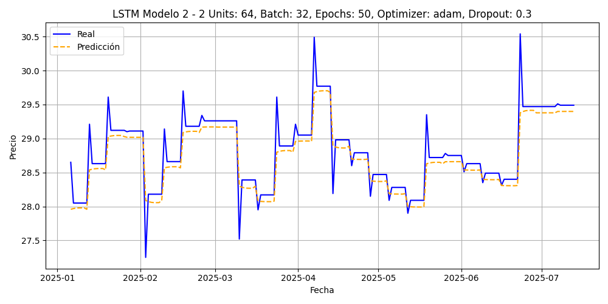
    </td>
  </tr>
  <tr>
    <td style="border: none;">
      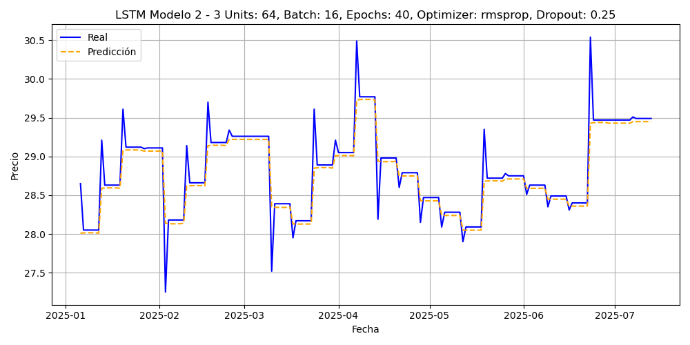
    </td>
    <td style="border: none;">
      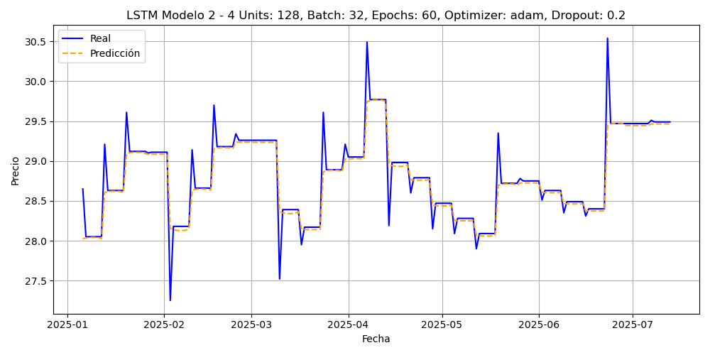
    </td>
  </tr>
</table>

### Conclusión

Si el objetivo es **minimizar el error promedio**, los modelos ARIMA siguen siendo competitivos.
Sin embargo, si se busca un modelo con **mejor capacidad de capturar dinámicas reales y abruptas**, los modelos **LSTM (especialmente Modelo 2 – 2)** son más adecuados, aunque con un pequeño costo en RMSE.

En función de las métricas y el comportamiento visual, **el mejor modelo globalmente fue LSTM Modelo 2 – 2**, al equilibrar precisión numérica con una representación realista del comportamiento del mercado.
