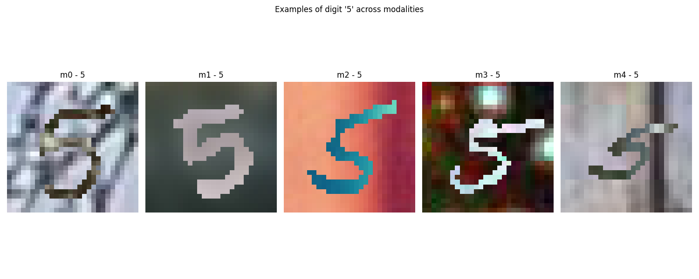

<!-- ---
header-includes:
  - \usepackage{amsmath}
  - \usepackage{amssymb}
  - \usepackage{fontspec}
  - \setmainfont{FiraCode Nerd Font}
  - \setmonofont{FiraCode Nerd Font Mono}
  - \usepackage{setspace}
  - \setstretch{1.5}
  - \usepackage{fvextra}
  - \DefineVerbatimEnvironment{Highlighting}{Verbatim}{breaklines,commandchars=\\\{\}}
  - \hypersetup{colorlinks=true, linkcolor=blue, urlcolor=blue}
  - \usepackage{geometry}
  - \usepackage{etoolbox}
  - \AtBeginEnvironment{longtable}{\scriptsize}
geometry: top=0.67in, bottom=0.67in, left=0.85in, right=0.85in
--- -->

# Laboratorio 3

## Análisis exploratorio

### 1. Visualización de ejemplos por modalidad

Se seleccionaron imágenes correspondientes al dígito `5` desde cada una de las cinco modalidades disponibles en el conjunto de datos (`m0` a `m4`). Cada modalidad presenta una variación distinta en el fondo, lo cual refleja la intención del dataset de simular distintas condiciones visuales.

La siguiente figura muestra un ejemplo del mismo dígito bajo distintas modalidades:



#### Observaciones

- **m0**: fondo texturizado en escala de grises.
- **m1**: fondo difuminado con tonalidades verdosas.
- **m2**: fondo color piel con degradado.
- **m3**: fondo altamente complejo, con múltiples colores y patrones.
- **m4**: fondo borroso, pero con patrones verticales visibles.

Estas variaciones introducen ruido visual al dígito, representando un reto importante para los modelos de reconocimiento. Es fundamental que los modelos aprendan a identificar el carácter ignorando las diferencias de fondo.

### 2. Análisis exploratorio del conjunto de datos

#### 2.1 Resolución de imágenes

Se analizó la resolución de una muestra aleatoria, obteniendo que todas las imágenes tienen un tamaño de:

```text
(28, 28) píxeles
```

Esto coincide con el tamaño del conjunto MNIST original, lo cual es apropiado para redes convolucionales pequeñas y modelos eficientes.

#### 2.2 Cantidad total de imágenes por modalidad

| Modalidad | Total de imágenes |
| --------- | ----------------- |
| m0        | 60,000            |
| m1        | 60,000            |
| m2        | 60,000            |
| m3        | 60,000            |
| m4        | 60,000            |

El dataset está perfectamente balanceado en cuanto al número total de imágenes por modalidad.

#### 2.3 Distribución de dígitos por modalidad

A continuación, se presenta la distribución de imágenes por dígito (0–9) en cada modalidad:

##### Modalidad m0

| Dígito | Cantidad |
| ------ | -------- |
| 0      | 5923     |
| 1      | 6742     |
| 2      | 5958     |
| 3      | 6131     |
| 4      | 5842     |
| 5      | 5421     |
| 6      | 5918     |
| 7      | 6265     |
| 8      | 5851     |
| 9      | 5949     |

> La misma distribución se replica en las modalidades `m1`, `m2`, `m3` y `m4`, dado que todas las modalidades comparten los mismos dígitos, pero con diferentes fondos visuales.

#### 2.4 Balance del conjunto de datos

Aunque existe una pequeña variación entre las clases (por ejemplo, dígitos como el `1` tienen más instancias que el `5`), el conjunto puede considerarse **razonablemente balanceado**. No es necesario aplicar técnicas de rebalanceo adicionales en esta etapa.

## Evaluación de Modelos de Deep Learning

### Modelos Convolucionales y Comparación

Se entrenaron múltiples arquitecturas de redes neuronales convolucionales (CNN) sobre el dataset **PolyMNIST** para la clasificación multiclase (dígitos del 0 al 9). Los modelos fueron comparados según su precisión de validación al finalizar 5 épocas de entrenamiento.

### Modelos evaluados y resultados

| Modelo                            | Arquitectura base               | Dropout | Optimizador | Precisión de validación |
| --------------------------------- | ------------------------------- | ------- | ----------- | ----------------------- |
| Simple CNN                        | Conv2D → MaxPool → Flatten → FC | No      | Adam        | 96.20%                  |
| VGG Style CNN (Dropout = 0.2)     | Conv2D x2 + Dropout             | 0.2     | SGD         | **98.44%**              |
| VGG Style CNN (Dropout = 0.3)     | Conv2D x2 + Dropout             | 0.3     | SGD         | 98.29%                  |
| Simple Dense NN (sin convolución) | Flatten → Dense x2 → Output     | No      | Adam        | 79.12%                  |

### Análisis de resultados

- El modelo **VGG con Dropout 0.2** obtuvo el mejor desempeño, logrando una precisión de **98.44%** sin signos visibles de sobreajuste. Su curva de pérdida descendió de forma constante y la precisión de validación superó al resto desde la segunda época.

- El modelo **Simple CNN** alcanzó una precisión competitiva de **96.20%**, pero mostró una leve tendencia al sobreajuste a partir de la época 3.

- El modelo **VGG con Dropout 0.3** tuvo un rendimiento casi igual al de 0.2, aunque con una curva de aprendizaje un poco más lenta.

- El modelo **Simple Dense NN** mostró el peor rendimiento (**79.12%**) y sobreajuste claro, reflejando la desventaja de no usar convoluciones para tareas de visión.

### Conclusión

El mejor modelo fue:

- **VGG Style CNN con Dropout 0.2**
- **Precisión en validación: 98.44%**
