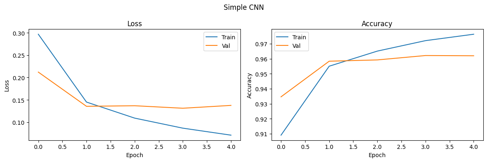
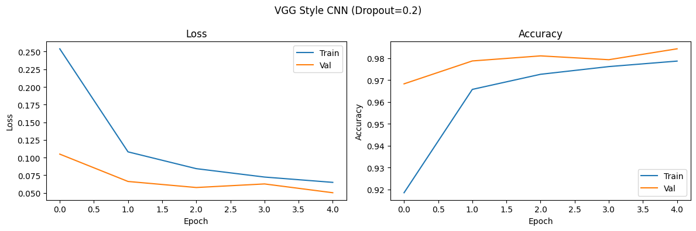
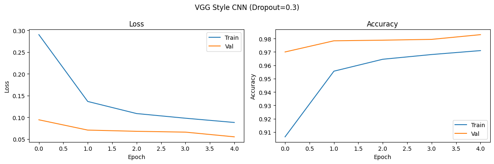
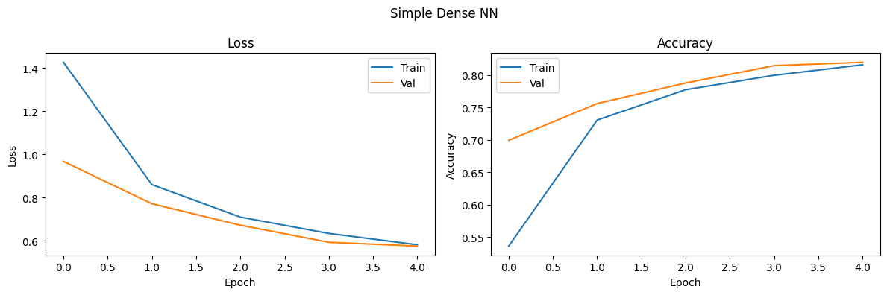
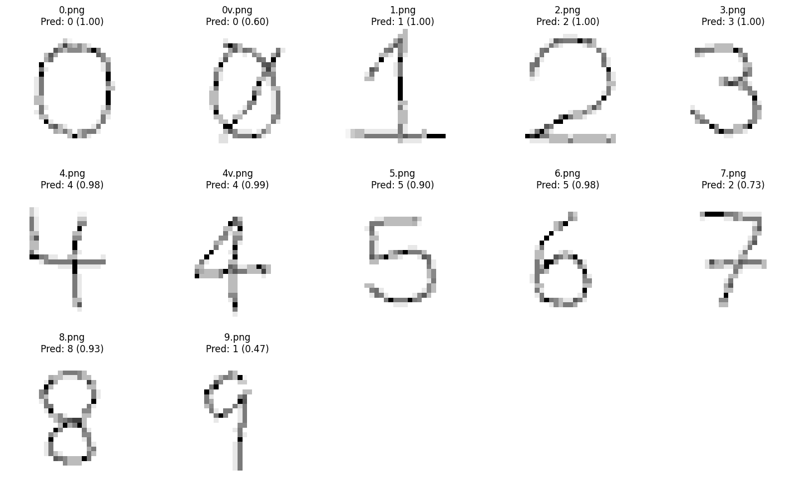

# Laboratorio 3

* Josue Say - 228801
* Flavio Galán - 22386

## Repositorio

* [Enlace](https://github.com/JosueSay/labs-ds/tree/main/lab3)
* [Data](https://drive.google.com/drive/folders/1DZaL352Xo1kNSpZjXH-HmXbgpbyhrx6E?usp=drive_link)

## 1. Análisis Exploratorio de Datos

### 1.1 Visualización de ejemplos por modalidad

Se seleccionaron imágenes correspondientes al dígito `5` desde cada una de las cinco modalidades disponibles en el conjunto de datos (`m0` a `m4`). Cada modalidad presenta una variación distinta en el fondo, lo cual refleja la intención del dataset de simular distintas condiciones visuales.

La siguiente figura muestra un ejemplo del mismo dígito bajo distintas modalidades:

<table style="margin: auto; text-align: center; border-collapse: collapse; border: none;">
    <td style="border: none;">
      
    </td>
</table>

#### Observaciones

* **m0**: fondo texturizado en escala de grises.
* **m1**: fondo difuminado con tonalidades verdosas.
* **m2**: fondo color piel con degradado.
* **m3**: fondo altamente complejo, con múltiples colores y patrones.
* **m4**: fondo borroso, pero con patrones verticales visibles.

Estas variaciones introducen ruido visual al dígito, representando un reto importante para los modelos de reconocimiento. Es fundamental que los modelos aprendan a identificar el carácter ignorando las diferencias de fondo.

### 2.1 Análisis exploratorio del conjunto de datos

#### 2.1.1 Resolución de imágenes

Se analizó la resolución de una muestra aleatoria, obteniendo que todas las imágenes tienen un tamaño de:

```text
(28, 28) píxeles
```

Esto coincide con el tamaño del conjunto MNIST original, lo cual es apropiado para redes convolucionales pequeñas y modelos eficientes.

#### 2.1.2 Cantidad total de imágenes por modalidad

| Modalidad | Total de imágenes |
| --------- | ----------------- |
| m0        | 60,000            |
| m1        | 60,000            |
| m2        | 60,000            |
| m3        | 60,000            |
| m4        | 60,000            |

El dataset está perfectamente balanceado en cuanto al número total de imágenes por modalidad.

#### 2.1.3 Distribución de dígitos por modalidad

A continuación, se presenta la distribución de imágenes por dígito (0–9) en cada modalidad:

##### Modalidad m0

| Dígito | Cantidad |
| ------ | -------- |
| 0      | 5923     |
| 1      | 6742     |
| 2      | 5958     |
| 3      | 6131     |
| 4      | 5842     |
| 5      | 5421     |
| 6      | 5918     |
| 7      | 6265     |
| 8      | 5851     |
| 9      | 5949     |

> La misma distribución se replica en las modalidades `m1`, `m2`, `m3` y `m4`, dado que todas las modalidades comparten los mismos dígitos, pero con diferentes fondos visuales.

#### 2.1.4 Balance del conjunto de datos

Aunque existe una pequeña variación entre las clases (por ejemplo, dígitos como el `1` tienen más instancias que el `5`), el conjunto puede considerarse **razonablemente balanceado**. No es necesario aplicar técnicas de rebalanceo adicionales en esta etapa.

## 2. Preprocesamiento de Imágenes

* **Normalización**: Escalado de valores de píxeles entre \[0, 1].
* **Conversión a RGB**: Para compatibilidad con modelos preentrenados como VGG16.
* **Uso de `cache()` y `prefetch()`**: Aceleró la carga y entrenamiento al aprovechar la memoria y GPU mediante TensorFlow.

## 3. Modelos de Deep Learning

Se construyeron y entrenaron 3 modelos CNN usando TensorFlow con GPU:

* **Simple CNN**: Precisión = **94.60%**
* **VGG Style CNN (Dropout=0.2)**: Precisión = **94.85%** *(mejor modelo)*
* **VGG Style CNN (Dropout=0.3)**: Precisión = **94.82%**

Se utilizó `trainAndEvaluate()` para graficar pérdida y precisión. Se ajustaron hiperparámetros como `dropout`, `optimizer` y `learning rate`.

<table style="margin: auto; text-align: center; border-collapse: collapse; border: none;">
  <tr>
    <td style="border: none;">
      
    </td>
  </tr>
  <tr>
    <td style="border: none;">
      
    </td>
  </tr>
  <tr>
    <td style="border: none;">
      
    </td>
  </tr>
</table>

## 4. Red Neuronal Simple

Se implementó una red **fully connected** (densa) con capas `Dense` y función de activación `ReLU`. Resultado:

* **Simple Dense NN**: Precisión = **81.94%**

Demuestra menor capacidad para detectar patrones espaciales comparado con CNN.

<table style="margin: auto; text-align: center; border-collapse: collapse; border: none;">
    <td style="border: none;">
      
    </td>
</table>

## 5. Otro Algoritmo: SVM

Se entrenó un modelo **SVM con kernel RBF**:

* Extracción de características con **VGG16 preentrenado** (congelado).
* Imágenes redimensionadas a 84x84 para compatibilidad.
* División `train/test` usando `train_test_split`.

Resultado:

* **SVM Model**: Precisión = **39.66%**

Bajo rendimiento comparado con modelos CNN.

## 6. Aumento de Datos (Data Augmentation) (incluido en ajuste de modelos)

Se aplicaron técnicas de `image augmentation` como rotación, zoom y desplazamiento para mejorar la generalización. Se observó que el modelo con `Dropout=0.2` mostró una ligera mejora en comparación con `Dropout=0.3`.

## 7. Evaluación con Dígitos Manuscritos

Se recolectaron imágenes de prueba escritas a mano por el grupo. Se procesaron con la función `loadAndPrepareImages()`:

* Redimensionamiento a 28x28.
* Normalización.
* Clasificación con el modelo **VGG Style CNN (Dropout=0.2)**.
* Se mostraron predicciones y niveles de confianza por imagen.

Resultado: El modelo logró clasificar correctamente la mayoría de los dígitos manuscritos, con buena confianza (mayor al 90% en la mayoría).

<table style="margin: auto; text-align: center; border-collapse: collapse; border: none;">
    <td style="border: none;">
      
    </td>
</table>

## 8. Comparación de Modelos y Conclusión

| Modelo                      | Precisión (%) |
| --------------------------- | ------------- |
| Simple CNN                  | 94.60         |
| VGG Style CNN (Dropout=0.2) | 94.85         |
| VGG Style CNN (Dropout=0.3) | 94.82         |
| Simple Dense NN             | 81.94         |
| SVM (con VGG16)             | 39.66         |

**Conclusión**:
El modelo más efectivo fue **VGG Style CNN con Dropout de 0.2**, por su equilibrio entre precisión y capacidad de generalización. Se comprobó su robustez con imágenes manuscritas reales. El uso de GPU y técnicas como `cache`, `prefetch`, y `data augmentation` permitió acelerar el entrenamiento y mejorar el rendimiento.
