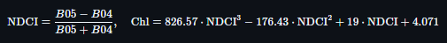

# Laboratorio 4

- Josue Say - 228801
- Flavio Galán - 22386

## Repositorio

- [Enlace](https://github.com/JosueSay/labs-ds/tree/main/lab4)
- [Data](https://drive.google.com/file/d/1HtrCx-AEMuC6CeKCLVbERCJMxmqiPB6v/view?usp=sharing)

## Obtención de datos

- **Fuente**: Sentinel-2 L2A (Copernicus).
- **Cobertura temporal**: **feb–ago 2025** (≈7 meses), **29 fechas** con nubosidad <20% (estos archivos se generan con el jupyter notebook y se encuentran como `dates.txt` e `intervals.json`):

  ```bash
  2025-02-07
  2025-02-10
  2025-02-25
  2025-02-27
  2025-03-02
  2025-03-04
  2025-03-07
  2025-03-09
  2025-03-12
  2025-03-14
  2025-03-19
  2025-03-22
  2025-03-24
  2025-03-26
  2025-04-03
  2025-04-11
  2025-04-13
  2025-04-15
  2025-04-16
  2025-04-18
  2025-04-28
  2025-05-03
  2025-05-13
  2025-05-28
  2025-07-10
  2025-07-17
  2025-07-20
  2025-07-24
  2025-08-01
  ```

- **Cobertura espacial**: dos AOI rectangulares en WGS84:
  - Atitlán: lon **\[-91.326256, -91.071510]**, lat **\[14.594800, 14.750979]**.
  - Amatitlán: lon **\[-90.638065, -90.512924]**, lat **\[14.412347, 14.493799]**.

- **Productos descargados**: colecciones por fecha para **NDVI**, **NDWI** y **clorofila-a (Cyano)**; consolidación en *stacks* multibanda + catálogos por fecha en `data/export_consolidated/`.

**Evidencia**: estructura de carpetas, GeoTIFFs por fecha en `data/<Lago>/Cyano_SH/*.tif`, y stacks en `export_consolidated/`.

## Visualización

- **Mapas estáticos** de clorofila por lago y fecha:

<table style="margin: auto; text-align: center; border-collapse: collapse; border: none;">
  <tr>
    <td style="border: none;">
      
    </td>
    <td style="border: none;">
      
    </td>
</table>

- **Mapas comparativos 2x2**:

<table style="margin: auto; text-align: center; border-collapse: collapse; border: none;">
  <tr>
    <td style="border: none;">
      
    </td>
    <td style="border: none;">
      
    </td>
</table>

- **Interactivos** (folium):

  - Para atitlán se puede revisar los html generados, para Atitlán `data/maps/Atitlan_CYANO_2025-05-03.html`, Amatitlán `data/maps/Amatitlan_CYANO_2025-05-28.html`.

## Índice de cianobacteria

- **Método**: NDCI sobre Sentinel-2 (bandas **B05/B04**) con máscara de agua y conversión a clorofila-a mediante polinomio:

  <!-- $$
  \text{NDCI}=\frac{B05-B04}{B05+B04},\quad
  \text{Chl} = 826.57\cdot \text{NDCI}^3 - 176.43\cdot \text{NDCI}^2 + 19\cdot \text{NDCI} + 4.071
  $$ -->

<table style="margin: auto; text-align: center; border-collapse: collapse; border: none;">
  <tr>
    <td style="border: none;">
      
    </td>
</table>

  (implementado en el *evalscript* y aplicado por fecha).

- **Salidas**: 29 TIFF por lago en `data/<Lago>/Cyano_SH/` y *stack* multitemporal en `export_consolidated/`.

**Evidencia**: mapas estáticos por fecha y comparativos 2x2.

## Análisis temporal

- **Serie temporal** (valor por fecha dentro del lago): `data/analysis/*_CYANO_series.csv` y gráficos:

<table style="margin: auto; text-align: center; border-collapse: collapse; border: none;">
  <tr>
    <td style="border: none;">
      
    </td>
    <td style="border: none;">
      
    </td>
</table>

- **Picos detectados** (percentil 90 sobre válidos; cobertura mínima 1%):
  - **Atitlán**: **3 picos** — **2025-03-07**, **2025-07-20**, **2025-08-01**; **máximo** ≈ **170.23** (`analysis/Atitlan_CYANO_peaks.json`, `report_outputs/peaks_summary.json`).
  - **Amatitlán**: **2 picos** — **2025-02-07**, **2025-08-01**; **máximo** ≈ **167.33** (`analysis/Amatitlan_CYANO_peaks.json`).

- **Hallazgos claros (a partir de las series)**
  - **Atitlán** muestra variabilidad alta y varios pulsos fuertes hacia julio–agosto.
  - **Amatitlán** presenta valores medios más bajos y menos picos, con un repunte importante en agosto.

- **Mapas comparativos**:
  - Atitlán y Amatitlán 2×2, donde las escenas de agosto exhiben áreas acuáticas con intensidades altas (escala relativa de Chl-a).

## Correlaciones NDVI/NDWI vs cianobacteria

- **Resultados numéricos** (`data/report_outputs/correlations_summary.json`):

  - **Atitlán** (n=14 fechas emparejadas):
    - **CYANO vs NDVI**: **r = +0.67** (Pearson), **rho = +0.29** (Spearman).
      -> A mayor “verdor” (NDVI) en la escena, tiende a aumentar la Chl-a en el lago.
    - **CYANO vs NDWI**: **r = −0.51**, **rho = −0.38**.
      -> Cuando el NDWI es más bajo (firma hídrica más débil en la escena), la Chl-a tiende a ser mayor.
  
  - **Amatitlán** (n=11):
    - **CYANO vs NDVI**: **r = +0.06** (rho = −0.15).
    - **CYANO vs NDWI**: **r = −0.12** (rho = +0.05).
      -> **Relaciones débiles/no concluyentes** en este periodo.

- **Soporte gráfico**: dispersogramas en `data/report_outputs/*_scatter_*.png`.

En Atitlán, los picos de Chl-a se alinean con escenas de alto NDVI y NDWI más negativo; esto sugiere estacionalidad/condiciones ambientales coincidentes con proliferación (p. ej., más biomasa en laderas/riveras y menor señal hídrica en orillas en esas fechas). En Amatitlán, la señal de NDVI/NDWI no explica bien la variación de Chl-a (posible influencia de forzantes locales no capturados por estos índices y/o menor número de pares válidos).

## Análisis y comparación entre lagos

- **Proliferación por lago (feb–ago 2025)**
  - **Atitlán**: más eventos (3 picos) y picos más altos (hasta \~170) con una tendencia al alza hacia jul–ago.
  - **Amatitlán**: menos eventos (2 picos) y valores medios moderados, con un repunte a inicios de agosto.

- **Intensidad y frecuencia**
  - **Frecuencia**: Atitlán > Amatitlán (3 vs 2 picos).
  - **Intensidad**: máximos comparables (170 vs 167), pero Atitlán mantiene más fechas con Chl-a elevada.

- **Posibles factores diferenciales (desde lo observado)**
  - **Relación con NDVI/NDWI**: en Atitlán sí hay señal climática/estacional en los índices; en Amatitlán no.
  - **Entorno en los mapas**: los 2×2 muestran en agosto mayor extensión/intensidad de Chl-a en ambos; sin embargo, el patrón temporal es más persistent en Atitlán.
  - **Advertencias**: análisis se acota a imágenes S2, máscara de agua y métricas espaciales/temporales usadas; no se incorporaron variables externas (viento, caudales, temperatura del agua, descargas puntuales), que podrían ser determinantes en Amatitlán.
