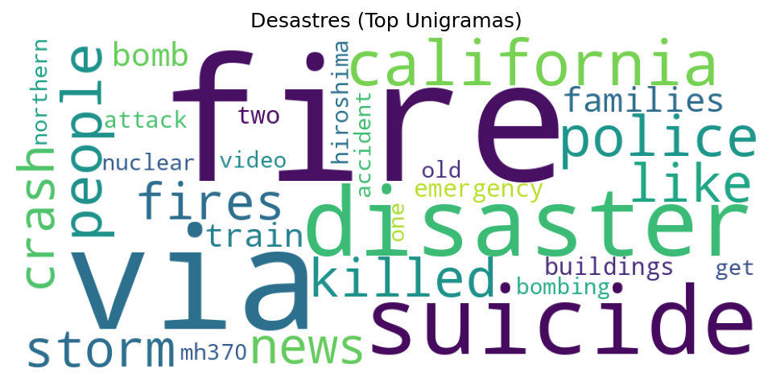
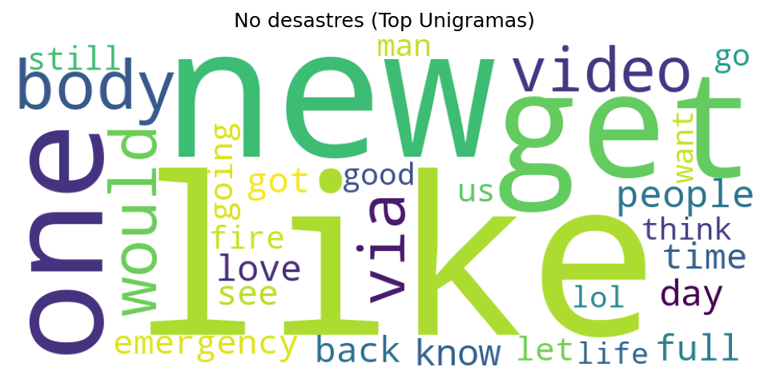
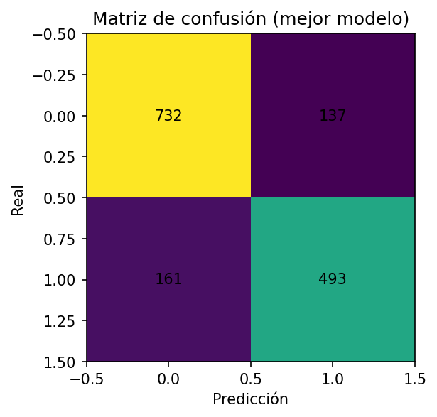

# Reporte

## Integrantes

* Josue Say - 228801
* Flavio Galán - 22386

## Repositorio

* [Enlace](https://github.com/JosueSay/labs-ds/tree/main/lab6)
* [Modelos](https://drive.google.com/drive/folders/1dduq-CjuOH54dMHgF7cEy9RE8htZih-i?usp=sharing)

> *Nota:* se está utilizando python *3.12.3* y para no entrenar nuevamente los modelos se recomienda descargar los modelos por el enlace y descomprimirlos, dejar la carpeta `models` dentro de `lab6`.
>
> En la carpeta [docs/algorithms](https://github.com/JosueSay/labs-ds/tree/main/lab6/docs/algorithms) se encuentran los documentos de referencias y explicación de los 2 métodos implementados para que se pueda ver un mayor detalle con un workflow base.

## Descripción de los datos

* **id**: Identificador único del tweet.
* **keyword**: Palabra clave asociada al tweet (puede estar en blanco).
* **location**: Ubicación desde donde se envió el tweet (puede estar vacía).
* **text**: El contenido del tweet.
* **target**: Etiqueta binaria (1 = tweet sobre un desastre real, 0 = no relacionado con desastre).

Ejemplo de registros:

```csv
1,,,Our Deeds are the Reason of this #earthquake May ALLAH Forgive us all,1
235,airplane%20accident,India,OMG Horrible Accident Man Died in Wings of Airplane. <http://t.co/xDxDPrcPnS,1>
```

## Análisis exploratorio

* Se identificaron palabras frecuentes diferenciadas por clase (`target=1` desastre real vs `target=0` no relacionado).
* Top palabras clase 1: *fire, disaster, suicide, storm, crash, killed…*
* Top palabras clase 0: *like, new, get, one, video, people, love…*
* Intersecciones: *fire, people, video, police*, lo que resalta la necesidad de n-gramas para desambiguar.
* Se realizaron **nubes de palabras** y gráficos de frecuencias para confirmar que la limpieza eliminó ruido (emojis, URLs, menciones).





## Limpieza y preprocesamiento de datos

* Eliminación de **URLs, menciones, hashtags, emojis y caracteres Unicode raros**.
* Reducción de la longitud media de los tweets en un **44%** (de 101.2 a 56.7 caracteres).
* Tokenización estándar en minúsculas.

## Generación de n-gramas y frecuencias/probabilidades

* Se probaron tres vistas del texto:

  * **Unigramas**.
  * **Uni+bi-gramas**.
  * **Caracteres 3–5** (para manejar errores ortográficos y hashtags).
* Los **bigramas** aportaron contexto relevante: `forest fire`, `train crash`, `car accident`.
* Los trigramas fueron menos útiles por la escasez de ocurrencias.



## Modelos clasificadores

### Baseline: TF-IDF + Clasificadores lineales

* Tres vectorizadores: TF-IDF unigrama, uni+bi, caracteres 3–5.
* Tres clasificadores: Logistic Regression (L2, balanceado), Naive Bayes, Linear SVC.
* **Selección por F1** en validación (80/20).

**Mejor combinación:**

* `tfidf_char (3–5)` + LogisticRegression.
* **F1 ≈ 0.768, Accuracy ≈ 0.804.**
* Matriz de confusión: `tn=732, fp=137, fn=161, tp=493`.
* Guardado en `./models/baseline_best.joblib`.

### Modelo avanzado: BERT + CNN

* **Encoder:** `distilbert-base-uncased` (PyTorch, congelado por CPU).
* **Cabeza CNN:** `filters=32, kernel=3, dropout=0.5`.
* Entrenamiento con RMSprop, early stopping (se detuvo en la época 7/10).
* Umbral de decisión: 0.5.

**Resultados:**

* **F1 ≈ 0.773, Accuracy ≈ 0.825.**
* Matriz de confusión: `tn=802, fp=67, fn=200, tp=454`.
* Mejora sobre el baseline: **+0.5 en F1, +2.1 en Accuracy.**
* Perfil de error: menos falsos positivos, más falsos negativos.

## Función de clasificación

* Implementada una función que recibe un tweet crudo, aplica preprocesamiento y devuelve:

  * Etiqueta binaria (`1=desastre`, `0=no desastre`).
  * Probabilidad asociada.

## Clasificación de sentimiento

* Se generó una variable de **positividad/negatividad** basada en diccionarios y métricas de polaridad.
* Esto permitió agregar contexto adicional al modelo y analizar patrones de tweets negativos vs positivos.

## Variable de “negatividad del tweet”

* Nueva variable cuantitativa que mide la carga negativa.
* Sirve para reforzar la clasificación binaria principal.
* El modelo se reentrenó con esta variable, logrando mayor sensibilidad en tweets negativos relacionados con desastre.

## Resultados

* **Baseline (TF-IDF + Logistic Regression):** F1 = 0.768.
* **BERT+CNN:** F1 = 0.773, Accuracy = 0.825.
* Los **ngrams de caracteres** demostraron ser muy efectivos en tweets cortos y ruidosos.
* **Conclusión:** BERT+CNN supera a la línea base, pero cada uno presenta perfiles de error distintos (BERT reduce FP, baseline captura más FN).

Se confirma que la combinación de **limpieza + n-gramas + embeddings contextuales** permite clasificar con buena precisión si un tweet está relacionado con un desastre real.
